# 🔍 USE CASE DIAGRAM

## 📌 What is a use case diagram?

In the Unified Modeling Language (UML), 
a use case diagram can summarize the details of your system's users 
(also known as actors) and their interactions with the system. To build one,
you'll use a set of specialized symbols and connectors. An effective use case diagram
can help your team discuss and represent:

⭐ Scenarios in which your system or application interacts with people, organizations, or external systems

⭐ Goals that your system or application helps those entities (known as actors) achieve

⭐ The scope of your system

## 📌 When to apply use case diagrams?
A use case diagram doesn't go into a lot of detail—for example, don't expect it to model the order in which steps are performed. Instead, a proper use case diagram depicts a high-level overview of the relationship between use cases, actors, and systems. Experts recommend that use case diagrams be used to supplement a more descriptive textual use case.

UML is the modeling toolkit that you can use to build your diagrams. Use cases are represented with a labeled oval shape. Stick figures represent actors in the process, and the actor's participation in the system is modeled with a line between the actor and use case.

 UML use case diagrams are ideal for:

⭐ Representing the goals of system-user interactions

⭐ Defining and organizing functional requirements in a system

⭐ Specifying the context and requirements of a system

⭐ Modeling the basic flow of events in a use case

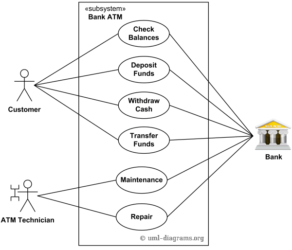    

## 📌 Use case diagram symbols and notation:

The notation for a use case diagram is pretty straightforward and doesn't involve as many types of symbols as other UML diagrams. 

|Name |Explanation |symbols
|--------|---------|-------|
|Use cases| Horizontally shaped ovals that represent the different uses that a user might have|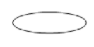   
|Actors| Stick figures that represent the people actually employing the use cases|
|Associations| A line between actors and use cases. In complex diagrams, it is important to know which actors are associated with which use cases|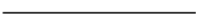
|System boundary boxes| A box that sets a system scope to use cases. All use cases outside the box would be considered outside the scope of that system. For example, Psycho Killer is outside the scope of occupations in the chainsaw example found below|
|Include| A use case always includes another use case. It's a required sub-process|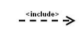
|Extend|A use case optionally extends another. It's used when some behavior is conditional|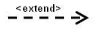  
|Generalization|Inheritance between actors or use cases. For example, Admin inherits from User|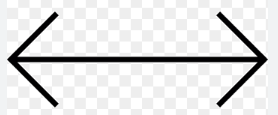

---------------------
# 🔍 Sequence Diagram

## 📌 What is a sequence diagram in UML?

A sequence diagram is a type of interaction diagram because it describes how—and in what order—a group of objects works together. These diagrams are used by software developers and business professionals to understand requirements for a new system or to document an existing process. 
Sequence diagrams are sometimes known as event diagrams or event scenarios.

## 📌 Benefits of sequence diagrams:

Sequence diagrams can be useful references for businesses and other organizations. Try drawing a sequence diagram to:

⭐ Represent the details of a UML use case.

⭐ Model the logic of a sophisticated procedure, function, or operation.

⭐ See how objects and components interact with each other to complete a process.

⭐ Plan and understand the detailed functionality of an existing or future scenario.

## 📌 Use cases for sequence diagrams:

The following scenarios are ideal for using a sequence diagram:

⭐ Usage scenario: A usage scenario is a diagram of how your system could potentially be used. It's a great way to make sure that you have worked through the logic of every usage scenario for the system.

⭐ Method logic: Just as you might use a UML sequence diagram to explore the logic of a use case, you can use it to explore the logic of any function, procedure, or complex process.

⭐ Service logic: If you consider a service to be a high-level method used by different clients, a sequence diagram is an ideal way to map that out.

## 📌  Basic symbols and components:

To understand what a sequence diagram is, you should be familiar with its symbols and components. Sequence diagrams are made up of the following icons and elements:

|Symbol|	Name	|Description
|-------|-----------|-----------|
|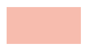 |Object symbol|Represents a class or object in UML. The object symbol demonstrates how an object will behave in the context of the system. Class attributes should not be listed in this shape.
|| Activation box |	Represents the time needed for an object to complete a task. The longer the task will take, the longer the activation box becomes.
|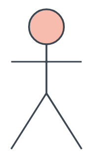|Actor symbol|Shows entities that interact with or are external to the system.
|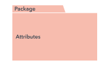|Package symbol |Used in UML 2.0 notation to contain interactive elements of the diagram. Also known as a frame, this rectangular shape has a small inner rectangle for labeling the diagram. 
|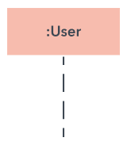|Lifeline symbol |	Represents the passage of time as it extends downward. This dashed vertical line shows the sequential events that occur to an object during the charted process. Lifelines may begin with a labeled rectangle shape or an actor symbol.
|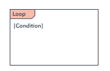|Option loop symbol	|Used to model if/then scenarios, i.e., a circumstance that will only occur under certain conditions.
|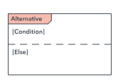|Alternative symbol|Symbolizes a choice (that is usually mutually exclusive) between two or more message sequences. To represent alternatives, use the labeled rectangle shape with a dashed line inside.

 

