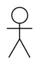

# 🔍 USE CASE DIAGRAM

## 📌 What is a use case diagram?

In the Unified Modeling Language (UML), 
a use case diagram can summarize the details of your system's users 
(also known as actors) and their interactions with the system. To build one,
you'll use a set of specialized symbols and connectors. An effective use case diagram
can help your team discuss and represent:

⭐ Scenarios in which your system or application interacts with people, organizations, or external systems

⭐ Goals that your system or application helps those entities (known as actors) achieve

⭐ The scope of your system

## 📌 When to apply use case diagrams?
A use case diagram doesn't go into a lot of detail—for example, don't expect it to model the order in which steps are performed. Instead, a proper use case diagram depicts a high-level overview of the relationship between use cases, actors, and systems. Experts recommend that use case diagrams be used to supplement a more descriptive textual use case.

UML is the modeling toolkit that you can use to build your diagrams. Use cases are represented with a labeled oval shape. Stick figures represent actors in the process, and the actor's participation in the system is modeled with a line between the actor and use case.

 UML use case diagrams are ideal for:

⭐ Representing the goals of system-user interactions

⭐ Defining and organizing functional requirements in a system

⭐ Specifying the context and requirements of a system

⭐ Modeling the basic flow of events in a use case

    

## 📌 Use case diagram symbols and notation:

The notation for a use case diagram is pretty straightforward and doesn't involve as many types of symbols as other UML diagrams. 

|Name |Explanation |symbols
|--------|---------|-------|
|Use cases| Horizontally shaped ovals that represent the different uses that a user might have|   
|Actors| Stick figures that represent the people actually employing the use cases|
|Associations| A line between actors and use cases. In complex diagrams, it is important to know which actors are associated with which use cases|
|System boundary boxes| A box that sets a system scope to use cases. All use cases outside the box would be considered outside the scope of that system. For example, Psycho Killer is outside the scope of occupations in the chainsaw example found below|
|Include| A use case always includes another use case. It's a required sub-process|
|Extend|A use case optionally extends another. It's used when some behavior is conditional|  
|Generalization|Inheritance between actors or use cases. For example, Admin inherits from User|

